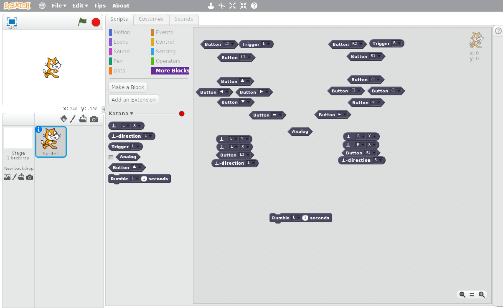

Katana
======

Katana is een uitbreiding voor Scratch 2.0 om controllers zoals PS3, Xbox of
andere USB controllers te gebruiken in de programma's die je maakt.
Nu kan je eindelijk die controller gebruiken voor je mario-kloon : )

Voorbereiding
=============

Een Scratch 2.0 uitbreiding bestaat uit twee delen. Voor Katana zijn dat
`katana.py` en `katana.nl.s2e`. `katana.py` is het programma dat verbindt met
je controller, dit moet altijd draaien anders kan Scratch 2.0 de controller
niet zien. Je moet natuurlijk ook de controller verbinden met de computer.

Nu moet je in Scratch 2.0 een verborgen menu gebruiken. Door de Shift-toets
ingedrukt te houden terwijl je klikt of `Bestand` zal er een nieuw keuze in dat
menu verschijnen, namelijk `Importeer experimentele HTTP-extensie`. Daar moet
je op klikken en dan moet je `katana.nl.s2e` selecteren.

Als je dit gedaan hebt zouden er nieuwe blokken moeten verschijnen onder `Meer
Blokken` (gewoonlijk een zwarte of grijze kleur). Boven deze blokken staat
normaal de naam "Katana" en een groen of rood bolletje, dit geeft aan of het
`katana.py` programma wel (groen) of niet (rood) goed werkt.

<figure>
  
  <figcaption>Katana blokken</figcaption>
</figure>

De blokken zijn zo uitgespreid dat ze ongeveer overeen komen met de posities op
een PS3 controller.

Gebruik
=======

Er zijn verschillende blokken voor alle verschillende knoppen en joysticks op
een controller.

Het `Knop` blok geeft aan of een knop wel of niet ingedrukt is. De meeste
controllers hebben redelijk veel knoppen. Voor een PS3 controller bijvorbeeld
zijn er de gewone knoppen: omhoog, omlaag, links, rechts, x, o, driehoek,
vierkant, select en start. Dan zijn er ook de schouderknoppen L1, L2, R1 en R2.
De joysticks kan je ook indrukken als een knop en die noemen we L3 en R3.

De knoppen L2 en R2 staan ook wel bekend als "trekkers" en ze hebben een
speciaal `Trekker` blok. Dit block geeft aan hoe ver ze ingedrukt zijn van 0
tot 100, dus als ze half ingedrukt zijn zal dit blok de waarde 50 hebben. Dit
is bijvoorbeeld handig in een race-spel waar je sneller gaat als je de trekker
meer indrukt.

Met het `Joystick` blok kan je aflezen hoe ver de joysticks geduwd worden. Voor
links-rechts gebruik je "X" en voor voor-achter gebruik je "Y." De waarden gaan
van -100, helemaal links of onder, tot 100, helemaal rechts of vooruit.

Er is ook het `Joystick-hoek` blok. Dit geeft aan in welke righting de
joystick geduwd wordt. De waarde gaat van 0° (rechts) over 90° (vooruit) naar
180° (links) dan 270° (onder) tot 360° (terug rechts).

Het `Analog` blok is voor een afzonderlijke knop op sommige controllers meestal
met een lichtje. Dit block geeft aan of de knop aan of uit staat. Op sommige
controllers moet dit aan staan om gebruik te kunnen maken van de joysticks.

Tenslotte is er het `Tril` blok, dit is om de controller te laten trillen maar
dat werkt nog niet.

Veel plezier met je controller in Scratch 2.0. Maak vooral veel coole
projecten!
